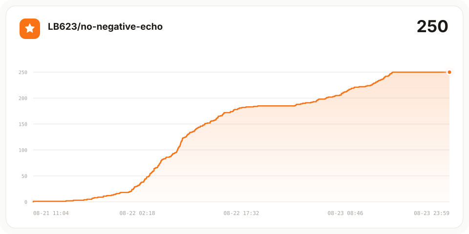

<p align="center">
  
</p>

<h1 align="center">No Negative Echo</h1>

<p align="center"><strong>Ship the accepted result, not the rejected proposal.</strong></p>

<p align="center"><em>Ship the result, not the conversation.</em></p>

<p align="center">
  <a href="./README.md">中文</a> · <strong>English</strong>
</p>

<p align="center">
  <a href="https://github.com/LB623/no-negative-echo/actions/workflows/test.yml"></a>
  <a href="https://github.com/LB623/no-negative-echo/stargazers"></a>
  <a href="./LICENSE"></a>
  
</p>

## The problem

An agent corrects its implementation, then lets the rejected proposal leak into the final title, comment, commit, PR, or handoff:

```diff
- Title: Tomato and Egg Stir-fry (without braised pork)
+ Title: Tomato and Egg Stir-fry
```

`no-negative-echo` is an [Agent Skills](https://agentskills.io/specification)-format skill. It has agents regenerate delivery text from the accepted, verified state and check delivery surfaces for session residue.

Use it to:

- Write commit messages, PR titles, and descriptions from the final diff
- Rewrite article titles, openings, UI copy, or handoffs
- Finalize work after long conversations, collaboration, or multiple revisions

## Star history

[](https://github.com/LB623/no-negative-echo/stargazers)

## Install

Ask an agent with network, terminal, and file permissions to follow the installation contract:

```text
Install the no-negative-echo Skill:
https://raw.githubusercontent.com/LB623/no-negative-echo/main/INSTALL.md
Report the installation result and whether a new session or restart is needed.
If verification is unavailable, do not claim that installation succeeded.
```

Local Codex example:

```bash
git clone https://github.com/LB623/no-negative-echo.git
cd no-negative-echo
python3 -I -m unittest discover -s tests -p 'test_*.py'
python3 -I scripts/install_skill.py \
  --expected-provenance-sha256 d42280b21f519ea00e417c68f31c68ca3d7faae607faf6dcb6e04beeff9c5ed6 \
  --discovery-root "$HOME/.agents/skills" \
  --agent codex
```

See [INSTALL.md](INSTALL.md) for other hosts, project-level installation, upgrades, and the complete safety contract.

## Use

Explicitly invoke the skill before creating a commit, PR, release note, or handoff:

```text
Use the no-negative-echo Skill.
Based on the final diff, write the commit subject, PR title, PR body, and handoff.
```

For editorial work:

```text
Use the no-negative-echo Skill.
Rewrite the title and opening from the final retained body.
```

## Decision rule

| Content | Treatment |
|---|---|
| A proposal discussed only in the session and absent from the final baseline | Omit |
| Assistant drafts, intermediate attempts, and wording corrections | Omit |
| Released API removals, migrations, and external operations | State accurately |
| Facts required for safety, law, compatibility, or audit | Keep |
| Comparisons, quotations, or decision records explicitly requested by the user | Keep |
| User changes that existed before the task | Preserve attribution; do not claim them as task output |

For every surface, ask:

1. Would a reader who never saw the session need this information?
2. Would omission make the result inaccurate, unsafe, misleading, or incompatible?
3. Is it a real change in the authoritative baseline that this surface needs to explain?

Something having been discussed or rejected is not, by itself, a reason to mention it.

## Boundaries

This is a prompt-level mitigation, not a deterministic filter:

- Discovery does not prove activation; explicitly invoke it for important delivery work.
- It cannot erase context already read by a model or control tool logs and host UI.
- Its bundled scanner checks text, filenames, and suspicious Unicode only; `PASS` is not a semantic review.
- Do not change APIs, migrations, tests, snapshots, or pre-existing user work merely to satisfy this skill.
- Use dedicated tools for credentials, privacy, and compliance checks.

See [SKILL.md](no-negative-echo/SKILL.md) for the default workflow. Sensitive data, public release, and strict validation load [high-assurance-finalization.md](no-negative-echo/references/high-assurance-finalization.md) only when needed.

## Development and evaluation

```bash
python3 -I -m unittest discover -s tests -p 'test_*.py'
```

The evaluation protocol and public cases are in [`evals/`](evals/). CI runs deterministic scripts and scorer tests; it does not make model-effectiveness claims.

## Further reading

- [Installation contract](INSTALL.md)
- [Background](BACKGROUND.md)
- [Evaluation protocol](evals/evaluation-protocol.md)
- [License](LICENSE)

## Feedback

When opening an issue, include the original request, actual output, expected output, location, and whether invocation was explicit or implicit. Remove credentials, personal data, and internal project names first.

Licensed under the [MIT License](LICENSE).
